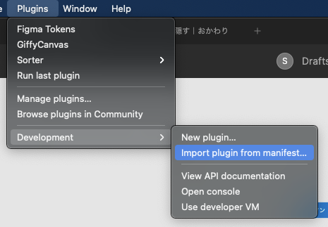

# SmartHR TextStyle Converter

## 読み込み方法

1. [リリース](https://github.com/uknmr/smarthr-textstyle-converter/releases/tag/0.0.1)から `SmartHR.TextStyle.Converter.zip` をダウンロードしてくる。
1. 適当な場所に解凍する
1. Figma でプロジェクトを開き、Plugins > Development > Import plugin from manifest... を開く
  
1. Finder が開くので先に解答したフォルダ内の `manifest.json` を選択し「開く」
1. Figma が解凍先のフォルダにアクセスしてもいいか聞いてくるので許可して

## 起動方法

Plugin > Development から `SmartHR TextStyle Converter` を選択するか、Quick actions...（`⌘ + /`）に `SmartHR TextStyle Converter` を選択してください。

直前の Plugin を呼び出す `⌘ + ⌥ + P` のショートカットを覚えておくと便利です。

## 使い方

Don't think. feel!
